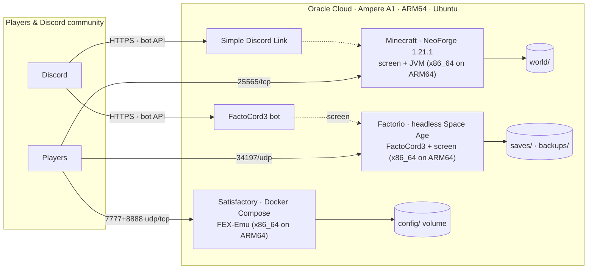
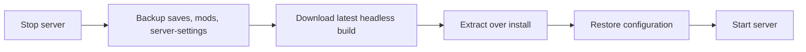

# Architecture

Project Ampere runs three headless game servers **concurrently on a single ARM64
Oracle Cloud (Ampere A1) instance** — Factorio, Minecraft, and Satisfactory —
all transparent to players as ordinary servers.

## Process supervision

| Server | Supervisor | Crash behaviour |
| --- | --- | --- |
| Factorio | `screen -dmS factorio` running the FactoCord3 bot | `run.sh` loop kills stale `factorio` processes, clears the lock file, and restarts after 5 s |
| Minecraft | `screen -dmS minecraft` (`run.sh` re-execs itself into screen) | operator `screen -r minecraft`; `user_jvm_args.txt` pins a 16 GB heap |
| Satisfactory | `docker compose up -d` with `restart: unless-stopped` | Docker restarts the container automatically |

The Satisfactory container also revalidates and re-installs the game on every boot
when `ALWAYS_UPDATE_ON_START=true`, so a replaced OCI instance or a fresh clone
converges to a running server without manual steps.

## Network

All inbound rules come from this repo (details in `scripts/bootstrap.sh` for the
Oracle **Security List**):

| Server | Port(s) | Protocol |
| --- | --- | --- |
| Minecraft | `25565` | TCP |
| Factorio (game) | `34197` | UDP |
| Factorio (RCON) | `34198` | TCP — `server-settings.json` |
| Satisfactory | `7777`, `8888` | UDP + TCP — `docker-compose.yml` |
| Satisfactory (game defaults, not remapped) | `15777` query, `15000` beacon | UDP |
| SteamCMD + Discord bridges | `443` outbound | TCP |

## Persistent storage

Re-downloadable binaries and generated caches are gitignored and live outside the
commit; the only files that must never be lost are kept on disk:

| Server | Path | Contents |
| --- | --- | --- |
| Factorio | `factorio-server/factorio/saves/` | `harvard.zip` + 5 rotating autosaves |
| Factorio | `factorio-server/factorio/data/server-settings.json` | server config (gitignored, live value on disk) |
| Factorio | `factorio-server/backups/` | pre-update snapshots of saves/mods/config |
| Minecraft | `minecraft-server/world/` | overworld/nether/end + advancement/MS data |
| Minecraft | `minecraft-server/sdlinkstorage/` | Discord account links (gitignored) |
| Satisfactory | `satisfactory-server/config/` | Epic `SaveGames/` + `SaveGames_backup/` (mounted as the container's `~/.config/Epic` volume) |

## Update pipeline

Factorio does this explicitly in `factorio-server/update_factorio.sh`. Satisfactory
does it implicitly on container start via SteamCMD (`+app_update 1690800 … validate`)
inside `init-server.sh`. Minecraft is a JVM-modded server whose update path is NeoForge's
installer (the gitignored `libraries/` + `mods/` regenerate on redeploy).